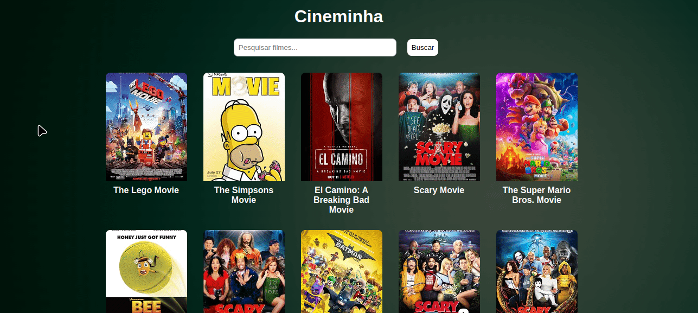

### Cineminha

**Cineminha** é apenas um projeto para praticar o consumo de API's, nesse caso usei [OMDb API](http://www.omdbapi.com/) para converter nomes de filmes e séries/animes em identificadores específicos, que são então usados para gerar códigos de embed através do [WarezCDN](https://warezcdn.link/)

<p align="center">
    
</p>

---
### Funcionalidades

- **Busca e conversão**:
  - **OMDb API**: Converte o nome do filme ou série em um identificador único, que é necessário para o WarezCDN gerar o código de embed correto.
  - **WarezCDN**: Usa o identificador para gerar um código de embed que pode ser incorporado diretamente na página para reprodução.

- **Preview dinâmico**:
  - Enquanto o usuário digita no campo de busca, sugestões de filmes e séries são exibidas com o pôster e a data de lançamento.
  - As sugestões são atualizadas em tempo real com base na entrada do usuário.

- **Reprodução de conteúdo**:
  - Após a seleção de uma sugestão e a busca do conteúdo, o filme ou série é exibido na página por meio de um iframe de embed fornecido pelo WarezCDN.

---
### Para desenvolvedores

1. **Clonar o repositório**

   Clone este repositório para sua máquina local:

   ```bash
   git clone https://github.com/aglairvta/cineminha.git
   cd cineminha
   ```

2. **Instalar dependências**

      ```bash
   npm install
   ```

3. **Criar variável de ambiente**

   Crie um arquivo .env na raiz do projeto e adicione sua chave da OMDB API.

   ```bash
   API_KEY=your_omdb_api_key
   ```

4. **Inicie o servidor**
   ```bash
   npm start
   ```

   O servidor estará disponível em http://localhost:3000.
---
